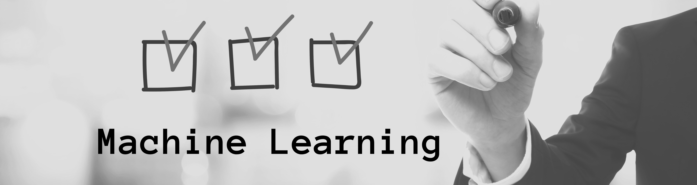

# CheckList-of-ML

In this repository, I will try to walktrough the basic Machine Learning Problems like(I got this idea form a Instagram Page named [machinelearning](https://www.instagram.com/machinelearning/)):

# Three Techniques:
Classification:
---
- Email Spam Filter
- Sentment Analysis
- Object Detection

Regression:
----
- Box office prediction
- Housing Price Prediction

Clustering:
---
- Image Segmentation
- Social Network Analysis
- Anomaly Detection

# Two Categories:
Supervised:
---
- SVM
-  Linear Regression
- Logistic Regression
- Navie Bayes
- Decision Tree
- K-nearest neighbour

Unsupervised:
---
- K-means Clustering
- Hierachical Clustering
- PCA
- Singular Value Decomposition
- Aprioro Algorithms
